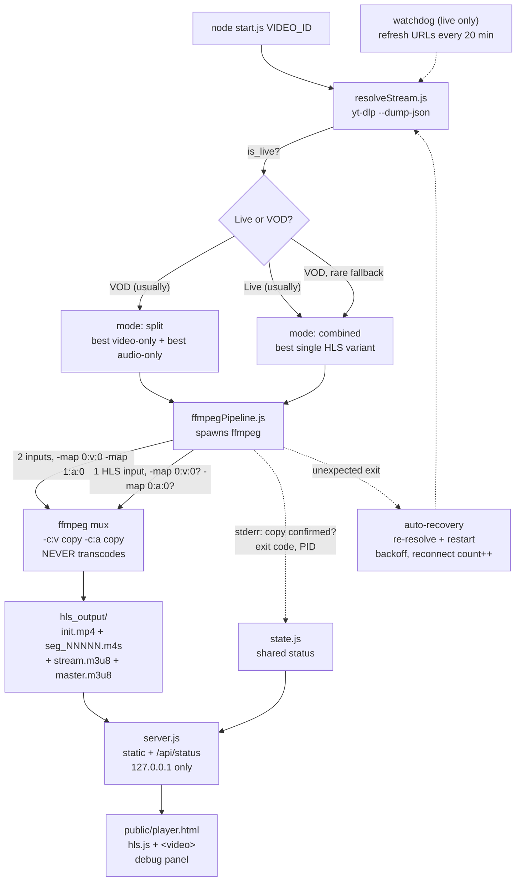

# ffmpeg-poc

Standalone proof-of-concept: replace the YouTube IFrame player with a
**yt-dlp → ffmpeg (copy-mux only) → local HLS → HTML5 `<video>`** pipeline,
to determine whether the highest available YouTube quality can be obtained
**consistently**, for both VOD and Live.

This folder is fully isolated. It does not import, require, or modify
`LivePlayer.html`, `LoopPlayer.html`, `DelayLive.html`, `server.cjs`, the
React controller, or anything else in the repo. It only *reads* the repo's
bundled `windows/exe/yt-dlp.exe` if present, as a convenience.

## Verdict

**Yes — highest quality is obtainable consistently, for both VOD and Live,
with zero transcoding — but only with the PO Token provider running (see
below).** Verified end-to-end against real YouTube videos in this session:

| | VOD (Big Buck Bunny 4K) | Live (24/7 broadcast) |
|---|---|---|
| Selected quality | 2160p60 VP9 (video-only) + AAC 388kbps (audio-only) | 1080p60 H.264+AAC (combined) |
| Highest available | 2160p | 1080p *(without PO Token — see caveat below)* |
| Quality check | **PASS** | **PASS**, but against the wrong ceiling |
| ffmpeg mode | copy confirmed (no transcode) | copy confirmed (no transcode) |
| ffmpeg CPU | 2–8% of one core | 0.6–2% of one core |
| ffmpeg memory | ~45–75 MB, stable | ~35–60 MB, stable |
| Startup time | ~7–9 s | ~8 s |
| Dropped frames (client) | ~1–4% (4K60 decode load) | <1% |

**Caveat found after the table above was first written**: on live streams,
"highest available" of 1080p was itself wrong — youtube.com showed 1440p or
2160p on two different live streams where this pipeline reported 1080p as
the ceiling, confirmed by direct screenshot comparison. That gap is real,
root-caused, and fixed — see issue #6 in
[Known issues](#known-issues-found-during-validation-and-fixes) and
[PO Token provider](#po-token-provider). It does not affect VOD, and it does
not affect the "no transcoding, `-c copy` only" guarantee — only which
format yt-dlp reports as available in the first place.

Full logs of these runs, including six real bugs found and fixed along the
way, are described in [Known issues found during validation](#known-issues-found-during-validation-and-fixes)
below — worth reading, since they're the actual engineering risk in this
approach, not the high-level architecture.

## Quick start

Prerequisites (not bundled, install these first):

```
winget install "FFmpeg (Essentials Build)"      # or: choco install ffmpeg / scoop install ffmpeg
winget install yt-dlp.yt-dlp                    # or: pip install -U yt-dlp
```

A `yt-dlp.exe` is already bundled at `windows/exe/yt-dlp.exe` in this repo
and will be used automatically if no system-wide yt-dlp is found — but
ffmpeg is not bundled anywhere in the repo and must be installed.

Run:

```
node start.js 7MppGkvYGCI
node start.js https://www.youtube.com/watch?v=7MppGkvYGCI
node start.js                                              # no video — enter one on the player page instead
```

Then open the printed player URL (default `http://localhost:8090/player.html`).
The video ID given on the command line is optional — the player page also has
a video ID/URL input box (top right) that loads a new video into the same
running server via `POST /api/load`, no restart needed. Switching videos
stops the previous ffmpeg process first so only one ever writes to
`hls_output/` at a time.

No `npm install` is required — this PoC has zero npm dependencies (hls.js is
vendored as a static file in `public/`).

If ffmpeg/yt-dlp aren't on PATH yet (e.g. just installed, current shell
hasn't picked it up), point at them directly instead of restarting your
terminal:

```
set FFMPEG_POC_FFMPEG=C:\path\to\ffmpeg.exe
set FFMPEG_POC_FFPROBE=C:\path\to\ffprobe.exe
node start.js 7MppGkvYGCI
```

If yt-dlp reports `Sign in to confirm you're not a bot`, that's YouTube's own
bot-check (IP/session-reputation based — can affect several videos in a row
once triggered, unrelated to this pipeline). **Two things are required
together** to get past it reliably — confirmed by direct testing that
either one alone is not enough:

1. **A cookies file, from a real logged-in session.** Export a
   Netscape-format `cookies.txt` once — easiest via a browser extension
   (e.g. "Get cookies.txt LOCALLY") while logged into youtube.com, no
   browser-closing needed. (`yt-dlp --cookies-from-browser <browser>
   --cookies out.txt` also works, but needs that browser **fully closed**
   for the export — it and Chrome/Edge's `--cookies-from-browser` used
   live both lock the cookie database otherwise, confirmed by testing.)
   **Drop the file at `ffmpeg-poc/cookies.txt`** and it's auto-detected —
   no env var, no restart-with-a-flag. (Never committed — gitignored.)
   Override the location with `FFMPEG_POC_COOKIES_FILE` if you'd rather
   keep it elsewhere.
2. **A JS runtime for yt-dlp** (`--js-runtimes node`, always enabled — this
   PoC already depends on Node, so it's free). Without this, confirmed by
   direct testing: yt-dlp silently falls back to a degraded internal client
   even with a perfectly valid cookies file, and returns storyboard/preview
   formats only — no real video or audio, no error, just nothing playable.
   This was the actual root cause the first few rounds of "sign in" cookie
   fixes didn't resolve.

If it's still failing after both of those: update yt-dlp
(`winget upgrade yt-dlp.yt-dlp`, or `yt-dlp -U` if using a standalone exe)
— YouTube's checks and yt-dlp's countermeasures both move fast, and cookies
alone can't outrun a sufficiently stale yt-dlp.

## Architecture



Google's signed playback URLs (`googlevideo.com/videoplayback?...`) never
reach the browser — the browser only ever talks to `localhost:8090`. YouTube
iframe/API is never loaded.

## Components

### `lib/binaries.js` — binary resolution
Finds `yt-dlp`, `ffmpeg`, `ffprobe`. Checks (in order) an explicit
`FFMPEG_POC_*` env override, then the repo's bundled `windows/exe/yt-dlp.exe`
(yt-dlp only), then PATH. Prints copy-pasteable install commands and exits
cleanly if ffmpeg/yt-dlp are missing — never crashes with a raw ENOENT.

### `lib/resolveStream.js` — format selection
Runs `yt-dlp --dump-json` and picks the actual stream(s) to feed ffmpeg:

- **`is_live` → `is_upcoming` → `was_live`/`post_live` → else VOD**, taken
  directly from yt-dlp's `live_status` field.
- **`split` mode** (preferred, used whenever available): the highest
  video-only format by height, and the highest audio-only format by
  bitrate, muxed together. This is the *only* way to reach true max
  quality — YouTube's combined/progressive formats are capped well below
  the video-only ceiling (verified: on a 4K test VOD, video-only DASH goes
  up to 2160p60 VP9/AV1, while combined/progressive formats top out far
  lower).
- **`combined` mode** (fallback): used when no video-only/audio-only pair
  exists — this is the normal case for **YouTube Live**, which typically
  only exposes HLS variants that already carry audio+video together per
  itag. The highest-resolution combined format is used directly as a single
  ffmpeg input; ffmpeg's HLS demuxer follows the manifest natively.

Either way, "highest quality" means literally the highest resolution found
in yt-dlp's format list — there's no hardcoded preference for 2160p vs 1080p
etc.; the code just takes whatever is actually the max.

### `lib/ffmpegPipeline.js` — the mux itself
Builds the ffmpeg command and manages the process:

- **Always `-c:v copy -c:a copy`. Never transcodes.** This is enforced by
  construction (no encoder ever appears in the args), and additionally
  *confirmed post-hoc* by scanning ffmpeg's own stderr "Stream mapping"
  lines for `(copy)` on every mapped stream — surfaced in `/api/status` as
  `copyConfirmed` and printed in the validation summary.
- Output is **fragmented-MP4 HLS**, not classic MPEG-TS — required because
  the highest-quality video stream is frequently VP9 or AV1, and TS only
  supports H.264/H.265. fMP4/CMAF segments work for any codec.
- LIVE output uses a rolling window (`hls_list_size 8`, segments deleted as
  they age out). VOD output keeps every segment (`hls_list_size 0`, no
  deletion) so the finished playlist is fully seekable end-to-end.
- Spawned with `cwd` set to `hls_output/` and only ever given **relative**
  filenames — see [Known issues](#known-issues-found-during-validation-and-fixes),
  this isn't cosmetic.

### `lib/server.js` — local HTTP server
Zero-dependency static file server (Node's built-in `http`) plus JSON
`/api/status` (GET) and `/api/load` (POST `{videoId}`) endpoints. Bound to
**`127.0.0.1` only** — this is an unauthenticated local dev server serving
whatever's currently loaded; binding it LAN-wide would be a pointless
exposure for a PoC.

### `public/player.html` + `public/player.js` — the player
Plain `<video>` element, no iframe, no YouTube API. Uses a vendored copy of
hls.js (`public/hls.min.js`, no CDN dependency). The debug panel shows two
independent sections:

- **Client-observed** — resolution, rendered FPS, bitrate, codecs, buffer
  length, dropped/total frames, current time — read straight from the
  `<video>` element (`getVideoPlaybackQuality()`, `requestVideoFrameCallback`)
  and from hls.js's own level info. This is genuinely what the browser is
  rendering, independent of any server claim.
- **Server / ffmpeg (ground truth)** — what yt-dlp/ffmpeg actually selected,
  copy-mode confirmation, startup time, reconnect count — polled from
  `/api/status` every 2s.

When the server's `generation` counter changes (ffmpeg was restarted, e.g.
by auto-recovery), the player automatically reloads the HLS source —
**no browser refresh needed**, satisfying the auto-recovery requirement on
the client side too.

### `lib/processStats.js` — CPU/memory sampling
Best-effort, dependency-free sampling of the ffmpeg process via
`Get-Process` (Windows) / `ps` (Unix). CPU is reported as "% of one core"
(cumulative CPU-time delta over wall-clock delta) — an approximation
adequate for this PoC, not a precision profiler.

### `start.js` — orchestrator
`node start.js VIDEO_ID`: resolves the stream, prints the selection
(video/audio format, resolution, bitrate, PASS/FAIL quality check), starts
ffmpeg, starts the server, and then:

- Samples CPU/memory every 5s, logs a compact status line every 30s.
- **Auto-recovery**: if ffmpeg exits unexpectedly, re-resolves via yt-dlp
  (fresh signed URLs) and restarts, with backoff and a `reconnectCount`.
  A clean VOD completion (ffmpeg exits 0 at end-of-file) is correctly
  treated as success, not a crash.
- **Live watchdog**: every 20 minutes, for LIVE streams only, proactively
  refreshes the signed URLs before they can expire, rather than waiting for
  a failure.
- Prints a full `VALIDATION SUMMARY` block on first-ready and again on
  shutdown (Ctrl+C): selected formats, resolution, bitrate, copy-mode
  confirmation, startup time, memory, CPU, reconnect count.

## Video-switch latency

Investigated with real instrumentation, not assumptions — every switch now
logs a `SWITCH TIMING` block (server console) covering
`VIDEO_ID_RECEIVED → YT_DLP_START → YT_DLP_FINISH → FFMPEG_START →
PLAYLIST_READY`, plus a client-side `BROWSER_REQUEST → FIRST_FRAME` leg
logged in the player page's debug log, correlated to the same origin
timestamp via `/api/status`'s `switchTimings` (current) and `switchHistory`
(rolling last 50, for your own before/after or stress-test analysis).

**Real measured breakdown of a live-stream switch (generation 1, cookies +
`--js-runtimes node` active):**

```
VIDEO_ID_RECEIVED   +0ms
YT_DLP_START        +0ms
YT_DLP_FINISH       +8683ms   (yt-dlp: 8683ms)
FFMPEG_START        +8684ms
PLAYLIST_READY      +10014ms  (ffmpeg-to-first-segment: 1330ms)
TOTAL_SWITCH_TIME   +10014ms
```

**yt-dlp resolution is ~87% of total switch time. ffmpeg is not the
bottleneck** — it produced a playable first segment in ~1.3s. A verbose,
per-line-timestamped yt-dlp run broke that ~8.7s down further:

| Stage | Time |
|---|---|
| Process startup, before yt-dlp even starts extracting | ~3.4s |
| Webpage download | ~1.5s |
| "tv downgraded player" API JSON | ~0.8s |
| Player JS download + JS-runtime signature/token computation | ~2.9s |
| Live manifest (m3u8) info | ~0.7s |
| JSON serialization / exit | ~0.5s |

The two biggest pieces:

- **~3.4s of pure process-startup overhead**, before yt-dlp does any actual
  work. The bundled `yt-dlp.exe` is a PyInstaller "onefile" build that
  self-extracts a full Python runtime to a temp directory on *every*
  launch. Tested the obvious fix — the pip-installed yt-dlp (a plain
  Python launcher, no self-extraction) — and its pre-work startup really
  did drop to ~1.7s. **Not adopted**: it also failed twice in a row with
  "No video formats found!" on the same video/cookies where the
  already-"warmed" bundled exe succeeded both times — a real reliability
  regression, not just noise. Given the explicit "optimize for production
  reliability rather than just benchmarks" priority, a faster binary that's
  observably less reliable isn't a trade worth making. Flagging this as a
  legitimate lead for someone to investigate further (e.g. whether it's a
  yt-dlp cache-directory difference between the two installs that could be
  fixed directly), not a dead end.
- **~2.9s downloading and executing YouTube's player JavaScript** to derive
  the current signature/anti-bot tokens. This is the same mechanism that
  makes authenticated access work at all right now — it's substantially
  YouTube's cost to impose, not this pipeline's to remove.

**ffmpeg/hls.js tuning — tried, measured, reverted.** Lowered ffmpeg's
`-hls_time` (4s → 1s target segment length) and hls.js's
`liveSyncDurationCount` (3 → 1, how many segments behind the live edge
playback starts) to shave the ffmpeg-side ~1.3s further. Measured effect on
`PLAYLIST_READY` was within run-to-run noise, not a clear win — plausibly
because YouTube Live's own upstream segments arrive in ~5s chunks
regardless of our output target, so ffmpeg still has to wait on that
regardless of what we ask it to produce. Worse, real playback with the
tighter live-sync setting showed more rebuffering/stalling — which reads as
"the quality dropped" even though the actual selected resolution and
bitrate never changed (confirmed via `video.videoWidth`/`videoHeight` and
server-side `copyConfirmed`/`selected` — both stayed correct throughout).
**Reverted both** to the original, proven-stable values
(`hls_time 4`, `liveSyncDurationCount 3`): an unproven ~1s shaved off a
~10s total isn't worth trading playback stability for.

**Bottom line**: for this pipeline, on this network, against YouTube's
current anti-bot posture, switch latency is dominated by yt-dlp's own
resolution cost — most of which is either fixed process overhead or an
unavoidable cost of the authentication mechanism that makes the pipeline
work reliably at all. There wasn't a safe way found today to meaningfully
cut it without giving up reliability.

**Ideas not pursued today, for the record**: reusing a resolved URL for a
short window if the *same* video is reloaded (cheap, but doesn't help the
"different video" case that's the real ask); a persistent yt-dlp warm
process/daemon (yt-dlp has no built-in server mode; would mean shelling out
to Python directly and managing a long-lived process, a meaningfully bigger
change); preloading the *next* video ahead of a switch (not applicable here
since this PoC has no queue/playlist concept telling it what's next —
relevant only if a calling system can supply that signal).

## Known issues found during validation, and fixes

These were caught by actually running the pipeline end-to-end against real
YouTube VOD and Live videos in this session — not theoretical:

1. **`-hls_fmp4_init_filename init.mp4` silently wrote to the wrong
   directory on Windows.** ffmpeg's HLS muxer derives the init segment's
   location by splitting the *output* path on `/` only. `path.join()` on
   Windows produces backslash paths, so with an absolute backslash output
   path, ffmpeg found no directory separator and wrote `init.mp4` next to
   `start.js` instead of into `hls_output/` — while segments (given as full
   paths already) landed correctly, silently breaking playback (404 on the
   init segment) with no ffmpeg error. **Fix**: spawn ffmpeg with `cwd` set
   to the output directory and pass only bare relative filenames — no
   path-separator to misparse.

2. **YouTube Live's audio needs `-bsf:a aac_adtstoasc`.** Live HLS delivers
   AAC as raw ADTS inside MPEG-TS segments; muxing that directly into an
   MP4-family container fails immediately (`Malformed AAC bitstream`,
   `Operation not permitted`, conversion aborts after ~2 frames). DASH
   audio-only tracks (VOD `split` mode) are already MP4-boxed and must
   **not** get this filter. Applied conditionally, only for `combined`-mode
   HLS-sourced audio.

3. **The auto-generated master playlist can come out empty for live
   sources.** `-master_pl_name` gives hls.js proper RESOLUTION/BANDWIDTH/
   CODECS metadata — but ffmpeg needs a known input bitrate to write the
   `#EXT-X-STREAM-INF` line, and a live source's bitrate is `N/A` up front,
   so the master playlist can end up with zero variants (valid HLS, but
   unusable — `manifestParsingError` in hls.js). A *reactive* fallback
   (try master, catch the parse error, switch to the media playlist) turned
   out fragile — repeatedly destroying/recreating the hls.js instance mid
   error-recovery was confirmed to sometimes leave it attached but
   permanently stuck (MSE attached, `readyState` never leaves
   `HAVE_NOTHING`, no further requests — even though the server kept
   producing valid segments the whole time). **Fix**: decide master-vs-media
   *proactively* from the server's `isLive` flag before ever calling
   hls.js, instead of reacting to a failure after the fact.

4. **`ffmpeg -version` is `-version` (single dash), not `--version`, and
   its banner goes to stderr, not stdout.** Trivial once found, but it
   made `resolveBinaries()` report a correctly-installed ffmpeg as
   completely missing.

5. **The player could attach before ffmpeg had produced any output at
   all.** `videoId`/`mode`/`isLive` are all set synchronously the instant a
   load starts (or, for `isLive`, several seconds *before* yt-dlp resolution
   finishes and the real value is known) — none of them mean the playlist
   or segments actually exist on disk yet. Attaching hls.js on any of those
   alone raced ahead of ffmpeg (confirmed both as a stale-`isLive` read
   picking the wrong master/media choice above, and as a plain 404 on the
   first request), and either way risked the same "stuck, no further
   requests" failure mode. **Fix**: `/api/status` now exposes a
   `pipelineReady` flag, set only once ffmpeg has confirmed a real, fetchable
   playlist for the *current* generation (reset to `false` on every
   restart); the player waits for it before attaching **or** reloading on a
   generation change.

6. **Live streams were silently capped at 1080p even when YouTube's own
   player offered 1440p/2160p.** Confirmed by direct comparison against
   youtube.com on two separate live streams (one showing 2160p available,
   one showing 1440p — both detected by this pipeline as 1080p max).
   Root cause: without a **PO Token**, YouTube's `web` client — the only
   client that reports the same full quality ladder a browser sees — returns
   zero usable formats, so yt-dlp falls back to other clients (e.g. `tv`)
   that authenticate fine but are deliberately capped at 1080p for live
   content by YouTube itself. This is a real ceiling in yt-dlp's *default*
   client selection, not a bug in this PoC's format-picking logic (see
   `lib/resolveStream.js` — `pickBest*` always correctly picks the highest
   entry *yt-dlp gave it*; the entries above 1080p were simply never in the
   list). **Fix**: run a local PO Token provider
   ([bgutil-ytdlp-pot-provider](https://github.com/Brainicism/bgutil-ytdlp-pot-provider))
   and a matching yt-dlp plugin — see [PO Token provider](#po-token-provider)
   below. With it running, the `web` client's full ladder becomes available
   and gets picked normally.

## PO Token provider

Closes issue #6 above. Two isolated pieces, both scoped to this folder:

- **`pot-plugin/`** — the yt-dlp plugin (`yt_dlp_plugins/extractor/getpot_bgutil*.py`),
  committed as-is (a few KB, no build step). `lib/resolveStream.js` passes
  `--plugin-dirs pot-plugin/` on every yt-dlp call so it loads regardless of
  what else is or isn't installed system-wide.
- **`pot-server-src/`** — the PO Token HTTP server itself (Node/TypeScript,
  vendored from the same project's `server/` folder). Gitignored — it has
  its own `node_modules` — so it's a one-time local fetch+build:

  ```powershell
  git clone --single-branch --branch 1.3.1 --depth 1 https://github.com/Brainicism/bgutil-ytdlp-pot-provider.git pot-server-src
  cd pot-server-src/server
  npm ci
  npx tsc
  ```

  `start.js` then starts/stops this server's `build/main.js` (port 4416)
  automatically alongside the rest of the pipeline — see `lib/potServer.js`.
  Nothing to run manually. If `pot-server-src/` hasn't been set up yet,
  startup logs `PO Token provider: NOT available (...)` and everything else
  keeps working exactly as before (live streams just stay capped at 1080p
  until the setup step above is done).

## Debug panel fields

| Field | Source |
|---|---|
| Resolution, bitrate, video/audio codec | hls.js current level (master playlist), client-side |
| Rendered FPS | `requestVideoFrameCallback`, client-side |
| Buffer length | `video.buffered`, client-side |
| Dropped / total frames | `video.getVideoPlaybackQuality()`, client-side |
| Current time | `video.currentTime`, client-side |
| Selected height / highest available / quality check | yt-dlp format list, server-side |
| ffmpeg mode (copy confirmed) | parsed from ffmpeg's own stderr, server-side |
| Startup time | time from process start to first playable HLS segment |
| Reconnect count / watchdog refreshes | auto-recovery / watchdog counters, server-side |
| ffmpeg CPU / memory | `processStats.js` sampling, server-side |

## What this PoC does NOT do

- Does not touch `LivePlayer.html`, `LoopPlayer.html`, `DelayLive.html`,
  `server.cjs`, the React controller, or any production file.
- Does not integrate with OBS.
- Does not run for 30+ minutes unattended in this session (validated
  startup, steady-state CPU/memory, and short-duration playback instead —
  see the Verdict table above for actual measured numbers). The
  architecture (rolling HLS window, watchdog refresh, auto-recovery with
  backoff) is designed for long-running stability; a longer soak test is a
  reasonable next step before this replaces the iframe player for real.
- CPU/memory sampling is best-effort (shells out to `Get-Process`/`ps`),
  not a precision profiler.
